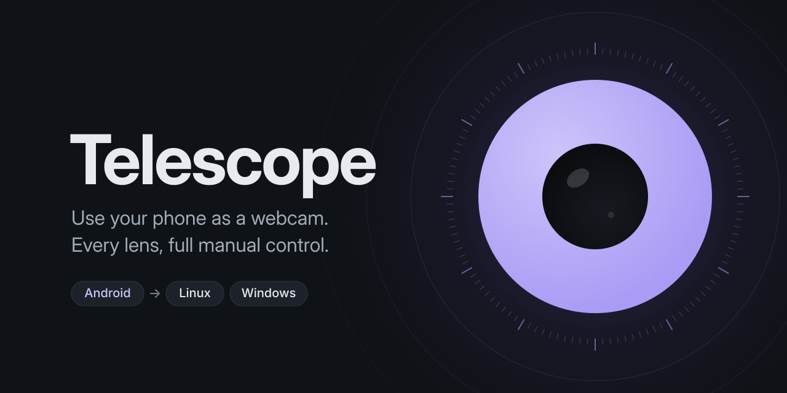

# Telescope

<p align="center"></p>

[](../../releases/latest)
[](../../releases)
[](../../actions/workflows/release.yml)
[](LICENSE)

[](https://ko-fi.com/lunarkittyy)

Telescope turns your Android phone into a webcam for your Linux or Windows computer, and lets you use any of its lenses like telephoto or ultra-wide.

- Shows up as a normal webcam in Discord, Zoom, OBS and anything else, and the phone's mic can be your microphone too
- Pick the lens, and set exposure, focus and white balance remotely from the computer
- Connects over USB or Wi-Fi, transfers data encrypted
- Can start streaming on its own when an app opens the camera and stop again once nothing's using it
- A built-in updater lets you install new versions in one click

It's free, all of it: no watermark, no ads, no account, no Pro version. Here's [how it compares](https://telescope.webcam/compare.html) with DroidCam, Iriun and Camo.

## Quick Start

You'll need an Android phone and a PC running Linux or Windows. No Android phone? [Browser camera](docs/features.md#browser-camera) streams from an iPhone or anything else with a browser, preferably Chrome (but please use the app when you can, it's better for battery life, quality and gives you way more customization options).

### 1. 🖥️ Get the desktop app

**🪟 Windows**

Download `TelescopeSetup.exe` from the [releases page](../../releases) and run it. It installs just for you, so it doesn't need admin.

Rather not install anything? `Telescope-windows.zip` has the same app: extract it and run `TelescopeDesktop.exe` (keep it in its folder: the `lib-...` folder next to it is part of the app).

**🐧 Linux**

Download `Telescope-linux.tar.gz` from the [releases page](../../releases), extract it, and run `./start.sh`. The launcher needs **Python 3.11 or newer**. Ubuntu 22.04 ships 3.10, so there install `python3.11` and `python3.11-venv` from the deadsnakes PPA first (see [manual setup](docs/setup.md#linux)). You'll also need a couple of things from your package manager:

- **`v4l2loopback`** - what the virtual camera runs on. Telescope switches it on when you stream, but can't install it.
  - Debian/Ubuntu: `sudo apt install v4l2loopback-dkms`
  - Fedora/Nobara: `sudo dnf install v4l2loopback`

  <details>
  <summary>💡 Fedora says it can't find that package?</summary>

  You need [RPM Fusion](https://rpmfusion.org/) enabled first (most Fedora installs don't have it by default - Nobara already does):
  ```bash
  sudo dnf install https://mirrors.rpmfusion.org/free/fedora/rpmfusion-free-release-$(rpm -E %fedora).noarch.rpm
  ```
  Then run the `dnf install v4l2loopback` command above again.

  </details>

- 💡 **`adb`** *(optional)* - only for pairing or installing the phone app over USB. Wi-Fi works without it.
  - Debian/Ubuntu: `sudo apt install adb`
  - Fedora/Nobara: `sudo dnf install android-tools`
  - Arch: `sudo pacman -S android-tools`

### 2. ✅ Follow the checklist

On first launch, the middle of the window is a checklist:

1. **Virtual camera** - on Windows, click **Install driver**. On Linux it checks for the package above and names it if it's missing.
2. **Phone app** - scan the code with your phone's camera to download `Telescope.apk`, then open it to install. (Your phone asks to allow "install from this source" the first time.)
3. **Add your phone** - open Telescope on the phone and click **Add phone**. Then tap **Scan pairing code** on the phone, or plug it in over USB and allow [USB debugging](https://developer.android.com/studio/debug/dev-options#enable) when the phone asks.
4. **Start streaming** - click **Start Streaming** in the top right corner. The phone's camera wakes up on its own.

After the first stream, the checklist is replaced by the video.

### 3. 📷 Use it as a webcam

In OBS (or anywhere else), pick **Phone Camera** (Linux) or **Telescope** (Windows) as your webcam. Installed the Windows driver with an older Telescope? It's still called **Unity Video Capture** until you click **Rename** in Advanced.

Telescope uses USB whenever the phone is plugged in and answering, and Wi-Fi otherwise. The Connection panel shows which one it's using, and if a cable is plugged in but not being used it tells you why. **Connect via** can force one or the other.

> [!NOTE]
> Use only on a trusted network, or enable **Local only - USB** in the Android app. See [Privacy](docs/features.md#privacy) for the full security model.

That's all most people need. The full feature list, troubleshooting and everything else is in [the docs](docs/README.md).

Stuck, or have an idea? Ask in [Discussions](../../discussions). Found a bug? Open an [issue](https://github.com/LunarKittyy/Telescope/issues/new?template=bug.yml) with your **Copy diagnostics** report.

## Questions people ask

<details>
<summary><b>Is it actually free?</b></summary>

Yes. Every feature, every resolution, no watermark, no ads. If you'd like to chip in anyway, there's [Ko-fi](https://ko-fi.com/lunarkittyy).
</details>

<details>
<summary><b>Does my video go through someone's server?</b></summary>

No. It goes straight from the phone to your computer, over USB or your own network, encrypted with TLS. There's no account and no cloud, and the apps only go online to check GitHub for updates. Details in [Privacy](docs/features.md#privacy).
</details>

<details>
<summary><b>Will it work with Discord / Zoom / Teams / OBS / my browser?</b></summary>

If it can use a webcam, yes. Telescope shows up as an ordinary camera, so there's nothing to set up in the app itself.
</details>

<details>
<summary><b>I have an iPhone or a Mac.</b></summary>

The phone app is Android only, but [Browser camera](docs/features.md#browser-camera) streams from an iPhone's browser with nothing to install. The desktop app runs on Windows and Linux, not macOS (yet?).
</details>

<details>
<summary><b>Can I use more than one phone?</b></summary>

Up to four at once, each its own webcam. Nice for a second angle in OBS.
</details>

<details>
<summary><b>Will it work on my phone?</b></summary>

It needs Android 8 or newer. [Device compatibility](docs/device-compatibility.md) lists what's been tested. If you try it on a phone that isn't there, [tell us how it went](https://github.com/LunarKittyy/Telescope/discussions/new?category=device-compatibility). That's one of the most useful things you can do for the project.
</details>

---

## Docs

- [Features](docs/features.md): everything Telescope can do
- [Troubleshooting](docs/troubleshooting.md): common problems and their fixes
- [Manual setup](docs/setup.md): the virtual camera and drivers by hand
- [All docs](docs/README.md), including the protocol and how it's built

## Helping out

Device reports, bug reports with a diagnostics report, and pull requests are all welcome. [CONTRIBUTING.md](CONTRIBUTING.md) has the details.

## License

Telescope is licensed under the [GNU Affero General Public License v3.0](https://www.gnu.org/licenses/agpl-3.0.html) - see [LICENSE](LICENSE) for the full text.

<details>
<summary>The license notice, and what it means for you</summary>

    Copyright (C) 2026 LunarKittyy

    This program is free software: you can redistribute it and/or modify
    it under the terms of the GNU Affero General Public License as published
    by the Free Software Foundation, either version 3 of the License, or
    (at your option) any later version.

    This program is distributed in the hope that it will be useful,
    but WITHOUT ANY WARRANTY; without even the implied warranty of
    MERCHANTABILITY or FITNESS FOR A PARTICULAR PURPOSE. See the
    GNU Affero General Public License for more details.

You are free to use, modify, and redistribute it, including for commercial purposes, provided derivative works remain under the AGPL-3.0 and you make the corresponding source available - including to users who interact with a modified version over a network. AGPL-3.0 is also compatible with the GPL v3 licensing of the bundled PyQt6 dependency.

</details>

## Third-party components

<details>
<summary>What's bundled, and under which licenses</summary>

Full notices (bundled binaries and Python runtime dependencies) are in [`desktop/THIRD_PARTY_NOTICES.txt`](desktop/THIRD_PARTY_NOTICES.txt), which ships inside both the Windows zip and the Linux tarball. Summary:

**UnityCapture** (`desktop/unitycapture/`) - DirectShow virtual camera filter for Windows.
Copyright (c) 2018 Bernhard Schelling. MIT License. See `desktop/unitycapture/LICENSE`.
Source: https://github.com/schellingb/UnityCapture

**Android SDK Platform Tools** (`desktop/platform-tools/`) - includes `adb.exe` for USB mode.
Copyright (c) Google LLC. Android Software Development Kit License Agreement.
See `desktop/platform-tools/NOTICE` and https://developer.android.com/studio/terms

**Python runtime dependencies** (PyQt6, opencv-python-headless, numpy, pyvirtualcam, qrcode, ifaddr, zeroconf, av, and sounddevice on Windows) - installed from PyPI; exact pinned versions are in `desktop/constraints.txt`. PyQt6 in particular is GPL v3-licensed (a commercial Riverbank Computing license also exists but isn't what this project uses).

</details>
